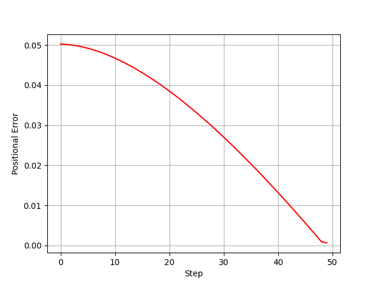

# Simple Trajectory Tracking
A smooth robot trajectory tracking algorithm.

## Algorithm
<p align="left">

Source : 'https://www.user.tu-berlin.de/mtoussai//teaching/Lecture-Robotics.pdf'

## Result
<p align="left">

## Dependencies
Install dependencies using:
```bash
pip3 install -r requirements.txt 
```
* Install mujoco-py as instructions given on -> 'https://github.com/openai/mujoco-py' 

## Contact
* email: navalekanishk@gmail.com